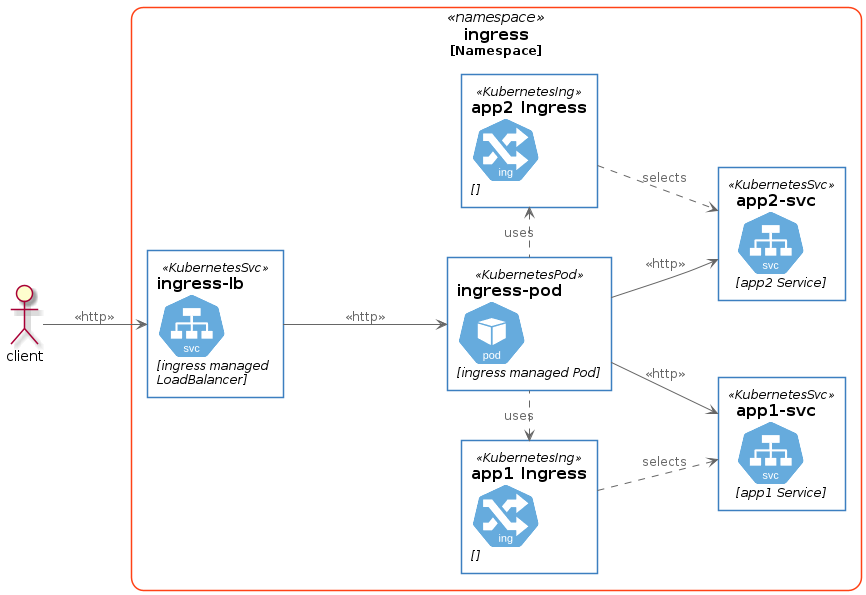

# Services and Ingress, and Ingress Controllers

Applications that are deployed in Kubernetes clusters often need to be
accessed from outside of the cluster.  There are three ways to do this: via
[Port Forwarding](#port-forwarding), via an [Ingress](#ingress), or via two special
types of Services called a NodePort, and a LoadBalancer. (For a more thorough
discussion of Kubernetes Services and networking see
[here](https://kubernetes.io/docs/concepts/services-networking/))

## Port Forwarding

A thorough from scratch example demonstrating Port Forwarding may be be found on
the Kubernetes main documentation site
[here](https://kubernetes.io/docs/tasks/access-application-cluster/port-forward-access-application-cluster/).
Essentially port forwarding is an easy ad hoc way to access a pod from the
outside the cluster from your workstation.  It is not meant for full production
use but can be handy provided you have `kubectl` access to the cluster.

## Ingress

The Kubernetes
[Ingress](https://kubernetes.io/docs/concepts/services-networking/ingress/)
can be particularly difficult to understand at first.  An Ingress resource is
essentially the description of how to publish and route http and https
traffic to a service.  Take the following example Ingress

```yaml
apiVersion: networking.k8s.io/v1
kind: Ingress
metadata:
  name: minimal-ingress
  annotations:
    nginx.ingress.kubernetes.io/rewrite-target: /
spec:
  rules:
  - http:
      paths:
      - path: /testpath
        pathType: Prefix
        backend:
          service:
            name: test
            port:
              number: 80
```

If you are familiar with setting up reverse proxies on a webserver, an Ingress
describes a similar function.  The ingress above describes the following

- A rule: when the cluster receives a request for `/testpath` it should forward
  the request to port `80` the service named `test`
- An annotation: `nginx.ingress.kubernetes.io/rewrite-target` which gives an
  extra hint to the [Ingress Controller](#ingress-controller) to guide its
  behavior.

## Ingress Controller

Ingress resources on their own do nothing, critically they require an
[Ingress Controller](#ingress-controller).  The controller is responsible for
monitoring the cluster for Ingress resources and then taking appropriate action
based on those resources.  Typically the controller deployment itself consists
of a webserver such as Nginx and then each ingress resource is transformed into
a set of proxy rules.  This is done without the developer needing to know
anything (or at least much) about the details of how that nginx configuration is
accomplished.



Very typically (especially in cloud environments) an Ingress Controller
deployment has within it its own LoadBalancer or NodePort service defined. This
LoadBalancer is managed by the controller and except in unusual circumstances it
should be left to the controller to deal with.

## [NodePort](https://kubernetes.io/docs/concepts/services-networking/service/#nodeport)

A NodePort exposes a service on a port on each node in the cluster. Since ports
are a limited resource you should generally avoid using NodePorts.  It is
important to note that accessing a particular port on the Kubernetes node which
is handled by a NodePort does not necessarily mean contacting the pod which is
running on that node. The traffic may be routed to any pod which matches the
NodePorts selector.  In addition the NodePort will be open even on nodes in the
cluster which are not running a pod matching the selector. In order to
accomplish that sort of "pod on this node" behavior one would need to use
[DaemonSet host ports](#daemonset-host-ports).

## [LoadBalancer](https://kubernetes.io/docs/concepts/services-networking/service/#loadbalancer)

Details of LoadBalancer implementations are beyond the scope of this
document. That said, a LoadBalancer is the representaion within Kubernetes of
a resource external to the cluster that will direct traffic to the cluster
according to its configuration.  For instance a AWS ELB or NLB LoadBalancer,
other similar cloud implementations, or something like [MetalLB](https://metallb.universe.tf/).

## DaemonSet host ports

DaemonSets have a special capability which allows them to expose ports directly
on the hosts their pods are running. This is configured within the DaemonSet
definition, and is enabled by setting the `hostPort` field of a containers port
definition to the desired port.  It suffers the same limitations as NodePorts,
i.e. that ports on the Kubernetes nodes are a limited resource, as well as the
additional drawback that hostPorts are not easily visible in the cluster
configuration as NodePorts are. They do have the advantage where the if you
access the port on a given node, you are guaranteed to be talking to the pod
running on that node.
